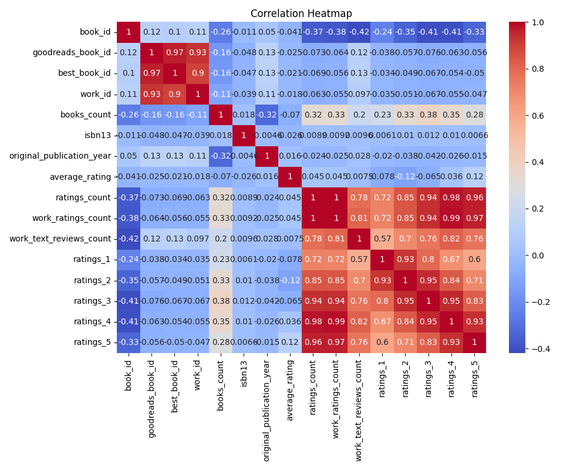

# Analysis of goodreads.csv

## Narrative Summary

# Dataset Analysis Narrative

## Overview
The dataset comprises 10,000 entries and 23 columns concerning various attributes of books, as aggregated from sources like Goodreads. This analysis aims to explore the data, identify patterns, and extract actionable insights.

## Data Structure

- **Shape**: (10,000, 23)
- **Key Columns**: 
  - `book_id`: Identifier for each book.
  - `goodreads_book_id`, `best_book_id`, `work_id`: Various book identifiers.
  - `authors`: Author(s) of the book.
  - `original_publication_year`: Year the work was originally published.
  - `average_rating`: Average rating of the book.
  - `ratings_count`: Total number of ratings received.
  - `work_ratings_count`: Ratings specific to the book's work.
  - `work_text_reviews_count`: Number of text reviews for the work.

## Missing Values
- The dataset has no missing values for critical columns such as `book_id`, `authors`, and `title`. However, it does have missing entries in:
  - `isbn (700 missing)`
  - `isbn13 (585 missing)`
  - `original_publication_year (21 missing)`
  - `original_title (585 missing)`
  - `language_code (1084 missing)`
  
This indicates a need for further data cleaning, especially for ISBN fields and language codes.

## Summary Statistics

- **Average Rating**: The mean rating across books is approximately **4.00** with a standard deviation of **0.25**, indicating that most books tend to receive favorable reviews.
  
- **Ratings Count**: The average number of ratings per book is around **54,001**, showing high engagement levels amongst readers.
  
- **Work Ratings Count**: Similarly, the average work ratings count is approximately **59,687**, suggesting a strong interaction with individual works.
  
- **Distribution of Ratings**:
  - The counts of ratings vary significantly, with ratings in the range of 1 to 5 showing a clear trend towards higher ratings (ratings of 4 and 5 are notably higher).

## Key Insights

### Author Popularity
- The most popular author, "Stephen King," appears 60 times. This suggests that particular authors can have a significant impact on the dataset and might be a focal point for marketing strategies.

### Language Diversity
- The `language_code` field shows diversity, with English (code 'eng') being predominant (6341 occurrences). This could influence selection and categorization strategies for non-English books.

### Ratings Distribution
- The correlation between `ratings_count` and `ratings_1`, `ratings_2`, `ratings_3`, `ratings_4`, and `ratings_5` is notably high (e.g., ratings_5 correlates at approximately 0.964). This indicates that as ratings increase, so does the number of total ratings received.
  
### Missing Data Handling
- The presence of missing values in critical fields (ISBNs and publication years) warrants a system to fill or handle these gaps intelligently—either through interpolation, external data enrichment or maintaining a separate classification.

## Recommendations

1. **Data Cleaning**:
   - Address and fill the missing values for ISBNs and language codes to ensure comprehensive and usable data.
  
2. **Enhanced Exploration**:
   - Perform exploratory data analysis (EDA) on language codes and publication years to identify trends in language utilization and publication popularity over time.
  
3. **Author Spotlight**:
   - Consider creating promotional content or events centered around popular authors like Stephen King to capitalize on their visibility in the dataset.
  
4. **Rating Analysis**:
   - Investigate books with low average ratings despite high ratings counts to identify potential reasons for discord between quantity and quality, possibly leading to improvements in content or curation.

5. **Tailored User Experience**:
   - Leverage the average ratings and number of reviews to recommend books to users based on their engagement patterns, thus enhancing personalization.

By considering these insights and recommendations, stakeholders can improve data handling processes, enhance user engagement, and optimize book marketing strategies.

## Visualizations

